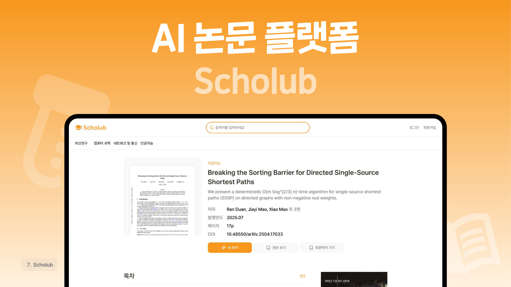
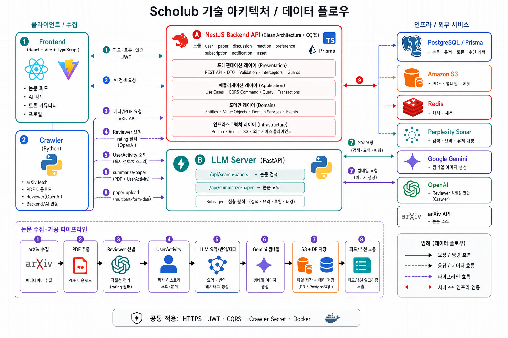

 

<h1>Scholub</h1>

하루에 수백 건씩 쏟아지는 최신 AI 논문을, 누구나 읽기 쉬운 뉴스로.

  
  
  
  
  
  

<b>디지털 콘텐츠 개발 대회 생활 부문 금상 수상작</b>

---

## 소개

Scholub은 arXiv에서 크롤링한 논문을 AI 학회(NeurIPS) 가이드라인 기반으로 자동 리뷰·선별한 뒤, 읽기 편한 뉴스 형식으로 재가공하여 번역과 함께 제공하는 AI 논문 종합 플랫폼입니다.

여기에 사용자 행동 기반 추천 알고리즘, LLM 서브 에이전트를 활용한 AI 검색, 실시간 논문 토론 커뮤니티 기능까지 통합 구현했습니다.

## 구성

| 디렉터리 | 역할 |
|---|---|
| `frontend` | 웹 클라이언트 — 논문 피드, AI 검색, 토론 커뮤니티 UI |
| `backend` | API 서버 — 인증, 논문 데이터, 추천, 토론 |
| `crawler` | arXiv 크롤러 / 논문 리뷰어 서비스 |
| `llm-server` | LLM 추론 / AI 검색 서버 |

## 역할

프론트엔드 메인 개발을 맡았습니다. 복잡한 아키텍처를 팀원들과 체계적으로 설계·조율하면서, 단순한 코딩을 넘어 전체적인 인터페이스와 사용자 경험을 설계했습니다.

## 기술 흐름

논문 수집부터 피드·AI 검색·토론까지, Scholub의 데이터와 요청이 어떻게 흘러가는지 한눈에 볼 수 있습니다.

## 아키텍처

Scholub은 클라이언트·백엔드·수집 파이프라인·LLM 서버를 분리한 구조입니다.

| 계층 | 구성 | 역할 |
|---|---|---|
| Client | React · Vite · TypeScript | 논문 피드, AI 검색, 토론 커뮤니티, 프로필 UI |
| Backend | NestJS (Clean Architecture · CQRS) | 인증(JWT), 논문·토론·추천·알림 API |
| LLM Server | FastAPI | AI 검색·요약·추천 서브 에이전트 |
| Crawler | Python | arXiv 수집, PDF 추출, 리뷰어 선별 |
| Infra | PostgreSQL · Redis · S3 · Docker | 메타데이터, 캐시/세션, 파일 저장, 배포 |

**요청 흐름**

1. 프론트엔드가 NestJS API로 피드·토론·인증 요청을 보냅니다.
2. AI 검색 요청은 NestJS를 거쳐 LLM 서버(`/api/search-papers`)로 전달됩니다.
3. 크롤러가 arXiv에서 논문을 수집·필터링한 뒤 LLM·Gemini로 요약·번역·썸네일을 생성하고, S3·DB에 저장합니다.
4. 저장된 데이터는 피드·추천 API를 통해 다시 클라이언트에 노출됩니다.
